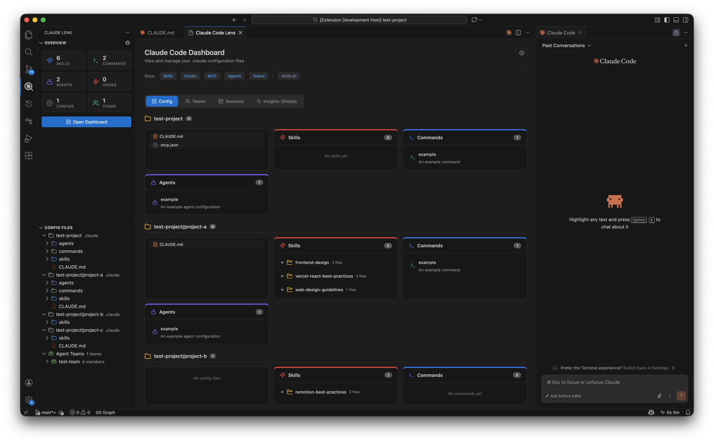
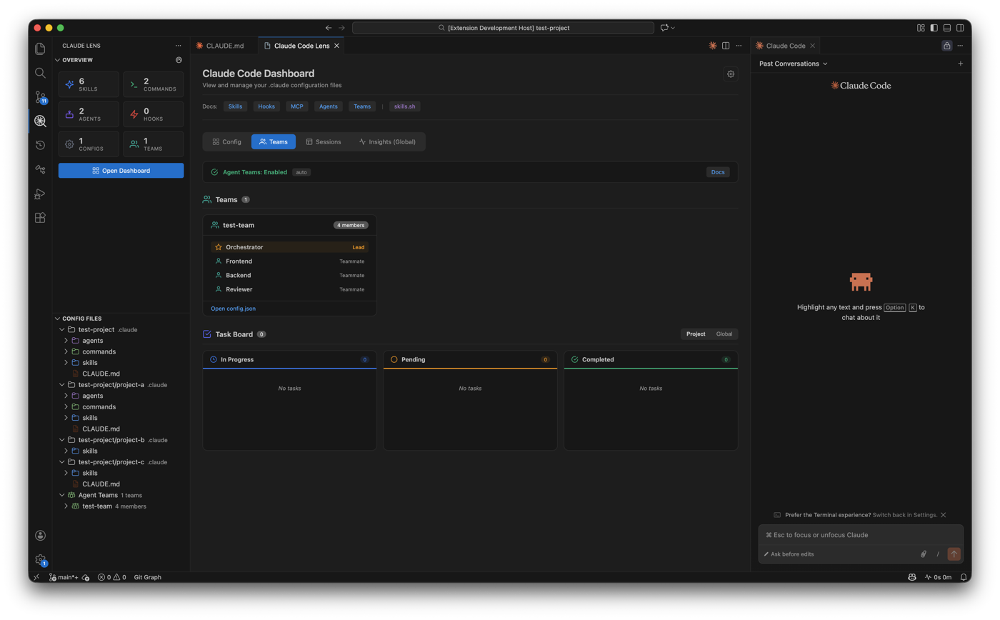
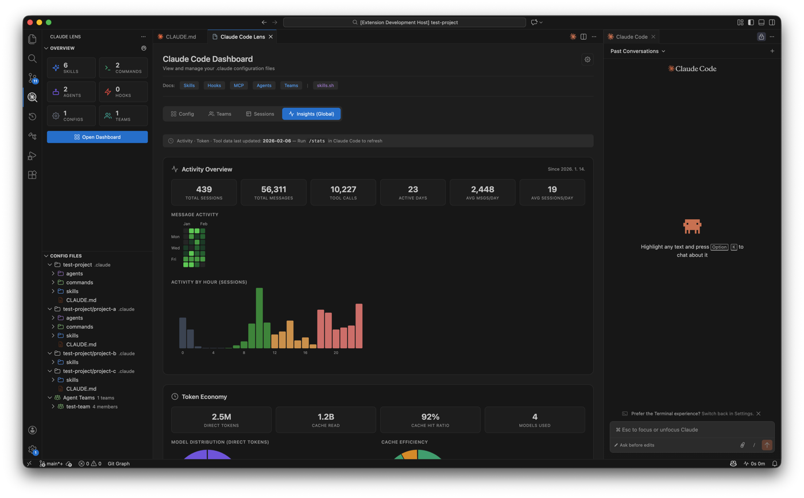

<h1 align="center">
  Claude Code Lens
</h1>

  <strong>Visualize and manage your <code>.claude</code> configurations, agent teams, and usage insights — all inside VS Code.</strong>

  

---

## Features

### Config Dashboard

Browse all `.claude` folders in your workspace at a glance. Skills, Commands, and Agents are grouped into color-coded cards.

### Agent Teams & Tasks

Monitor active agent teams and their members. Track task progress on a kanban board.

### Usage Insights

Activity heatmap, token usage, session quality, tool breakdown, and project focus — powered by local Claude Code stats.

### AI Commit Message

Generate conventional commit messages with one click using Claude CLI.

---

## Extension Settings

Configure in VS Code Settings (`Cmd+,` → search `claudeLens`):

| Setting                    | Default  | Description                                 |
| -------------------------- | -------- | ------------------------------------------- |
| `claudeLens.commit.model`  | `haiku`  | Claude model (`haiku`, `sonnet`, `opus`)    |
| `claudeLens.commit.prompt` | built-in | Custom prompt for commit message generation |

---

## Requirements

- **Claude CLI** — Install from [docs.anthropic.com/claude-code](https://docs.anthropic.com/en/docs/claude-code)
- Run `claude login` in terminal to authenticate

---

## License

[MIT](LICENSE)
