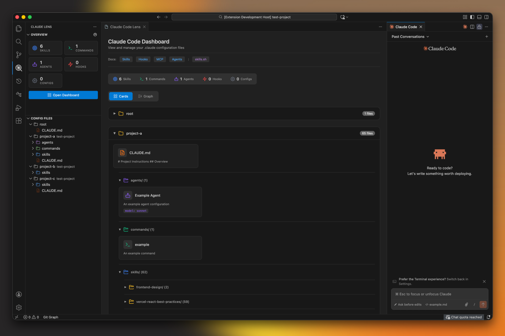
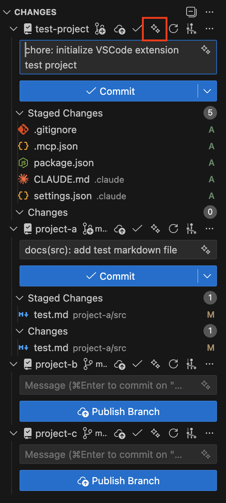

<h1 align="center">
  Claude Code Lens
</h1>

  <strong>Visualize and manage <code>.claude</code> configuration folders directly in VS Code</strong>

  

---

---

## Features

- **Overview Panel** — Stats for Files, Skills, Commands, Agents, Configs
- **Config Files Panel** — TreeView of all `.claude` folders in workspace
- **Dashboard** — Card view with file counts per folder
- **AI Commit Message** — Generate commit message from git diff using Claude CLI

---

## AI Commit Message

Generate conventional commit messages with one click using Claude CLI.

Click the sparkle icon (✨) in the Source Control panel to generate a commit message from your staged changes.

---

## Extension Settings

Configure in VS Code Settings (`Cmd+,` → search `claudeLens`):

| Setting                    | Default  | Description                                 |
| -------------------------- | -------- | ------------------------------------------- |
| `claudeLens.commit.model`  | `haiku`  | Claude model (`haiku`, `sonnet`, `opus`)    |
| `claudeLens.commit.prompt` | built-in | Custom prompt for commit message generation |

---

## Requirements

- **Claude CLI** — Install from [docs.anthropic.com/claude-code](https://docs.anthropic.com/en/docs/claude-code)
- Run `claude login` in terminal to authenticate

---

## License

[MIT](LICENSE)
