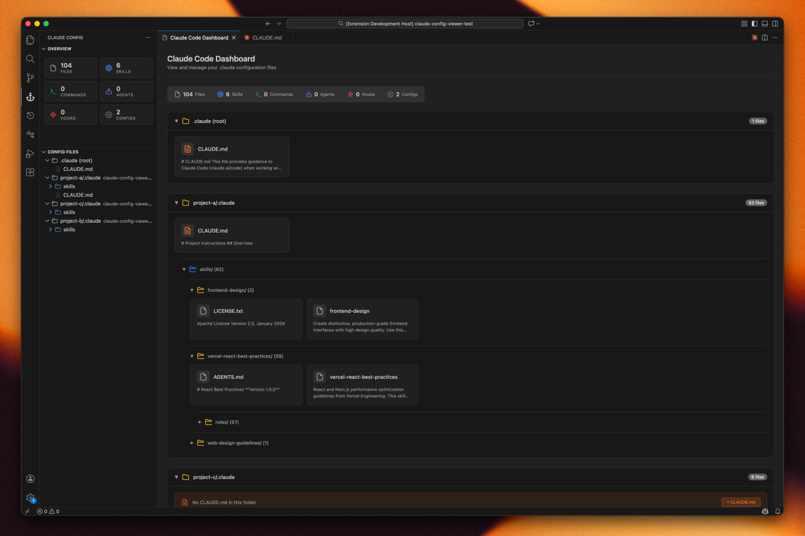

<h1 align="center">
  Explorer for Claude Code
</h1>

  <strong>Visualize and manage <code>.claude</code> configuration folders directly in VS Code</strong>

  
  
  

---

---

## Features

- **Overview Panel** — Stats for Files, Skills, Commands, Agents, Hooks, Configs
- **Config Files Panel** — TreeView of all `.claude` folders in workspace
- **Dashboard** — Card view with file counts per folder

## License

[MIT](LICENSE)

---

  Made with ❤️ for Claude Code users

